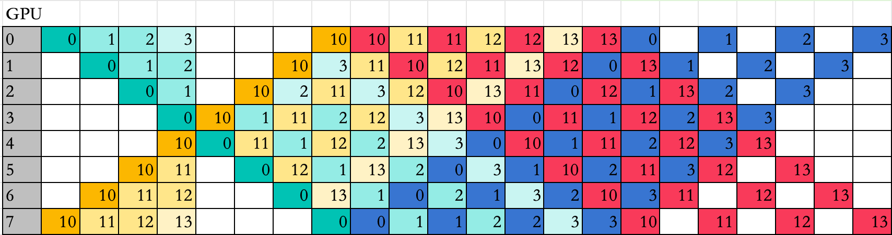

# easy-dualpipe
Pipeline-Parallel Lecture: Simplest Dualpipe Implementation.

Inspired by `DeepSeek-V3` and [DualPipe](https://github.com/deepseek-ai/DualPipe), We designed and implemented a simplest dualpipe-like schedule.

## Run

run `dualpipe_step.py` and `dualpipe.py` 

## Reference

[DualPipe](https://github.com/deepseek-ai/DualPipe)

## About

this repo is part of lecture: "LLM from scratch". This repo Not to be used for any commercial purposes without permission.

License: CC-BY-NC-ND-4.0